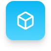
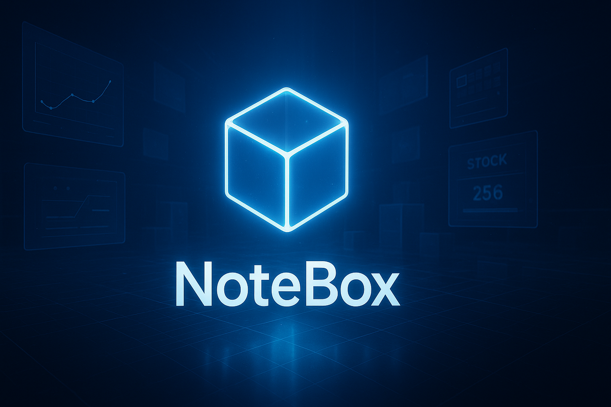

<p align="center">
  
</p>

<h1 align="center">NoteBox – Sistema de Gestión de Inventario</h1>
<p align="center">Aplicación desarrollada para la administración y control de inventario de Papelería Valeria.</p>

---

## 1. Descripción General

NoteBox es un sistema de gestión de inventario diseñado para optimizar el control de productos en papelerías y pequeños negocios. Su arquitectura estructurada, interfaz moderna y herramientas integradas permiten una administración eficiente, rápida y confiable.

El sistema proporciona:

- Control completo de productos.  
- Registro de movimientos de entrada y salida.  
- Estadísticas y reportes visuales.  
- Gestión de usuarios y roles.  
- Alertas automáticas de inventario.  
- Personalización visual y configuraciones del sistema.  

---

## 2. Vista Previa

<p align="center">
  
</p>

<p align="center">
  
</p>

<p align="center">
  
</p>
---

## 3. Características Principales

### • Dashboard principal  
Panel con estadísticas, gráficos y alertas de inventario.

### • Gestión de Inventario  
- Registro de productos.  
- Edición, eliminación y filtros avanzados.  
- Control de stock y categorías.

### • Movimientos de Inventario  
- Entradas y salidas con historial detallado.  
- Validación automática de existencias.

### • Reportes  
- Exportación en PDF y Excel.  
- Gráficos estadísticos generados con matplotlib.

### • Gestión de Usuarios  
- Roles: Administrador y Empleado.  
- Alta, baja, edición y control de accesos.

### • Notificaciones  
- Alertas de stock bajo, productos agotados y movimientos recientes.

### • Configuración del Sistema  
- Datos empresariales.  
- Apariencia (tema claro/oscuro).  
- Respaldos automáticos.

---

## 4. Tecnologías Utilizadas

| Categoría | Tecnología |
|----------|------------|
| Lenguaje principal | Python 3.x |
| Interfaz gráfica | CustomTkinter |
| Base de datos | MySQL |
| Reportes PDF | reportlab |
| Exportación Excel | openpyxl, xlsxwriter |
| Gráficos | matplotlib |
| Utilidades | Pillow, numpy, python-dotenv |

---

## 5. Instalación

### 1. Clonar el repositorio  
```bash
git clone https://github.com/diego-frias-ramirez/notebox.git
cd NoteBox
2. Instalar dependencias
bash
Copiar código
pip install -r requeriments.txt
3. Configuración de la base de datos
Instalar y ejecutar MySQL.

Importar el archivo:

pgsql
Copiar código
model/database/db_schema.sql
Configurar credenciales en:

arduino
Copiar código
config/db_config.json
4. Ejecutar la aplicación
bash
Copiar código
python main.py
6. Estructura del Proyecto
txt
Copiar código
NoteBox/
│
├── assets/
│   ├── icons/           # Iconos del sistema
│   ├── images/          # Imágenes generales y banners
│   └── styles/          # Colores, fuentes y temas
│
├── components/          # Componentes de interfaz reutilizables
├── config/              # Configuraciones del sistema
├── controller/          # Lógica de negocio
├── docs/                # Documentación técnica
├── exports/             # Backups, reportes y logs generados
├── logs/                # Registro de errores y actividad
├── model/               # Modelos y acceso a datos
├── tests/               # Pruebas automáticas
├── utils/               # Funciones auxiliares
└── view/                # Vistas de la interfaz gráfica
7. Uso del Sistema
Al iniciar NoteBox, se mostrará la pantalla de inicio de sesión.
Una vez autenticado, el usuario podrá navegar mediante la barra lateral por:

Dashboard

Inventario

Movimientos

Reportes

Usuarios

Configuración

Centro de ayuda

Notificaciones

Cada módulo cuenta con botones contextuales, tablas interactivas, formularios y filtros.

8. Contribuciones
Las contribuciones están abiertas.
Para colaborar:

Crear un fork.

Trabajar en una rama separada.

Enviar un Pull Request describiendo los cambios.

9. Licencia
Este proyecto está licenciado bajo la MIT License.
Consulta el archivo LICENCE para más detalles.

10. Contributors

Frias Ramirez Diego Fernando

Valenzuela De la Cruz William

Gonzalez Conde Derian Octavio

Martinez Martinez Cristian Alfonso

Quiñones Cervantes Ignacio